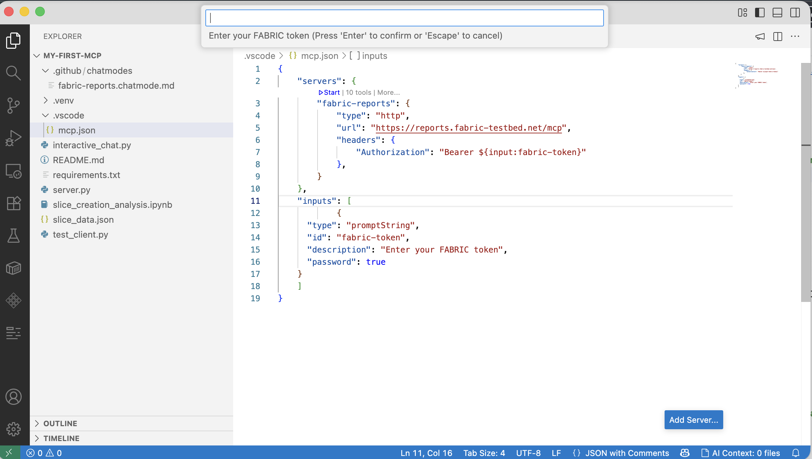
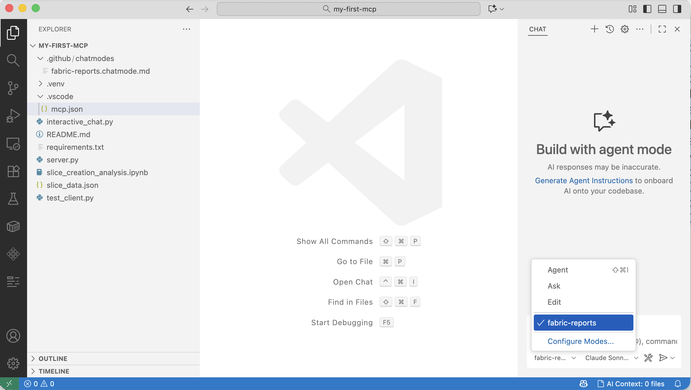
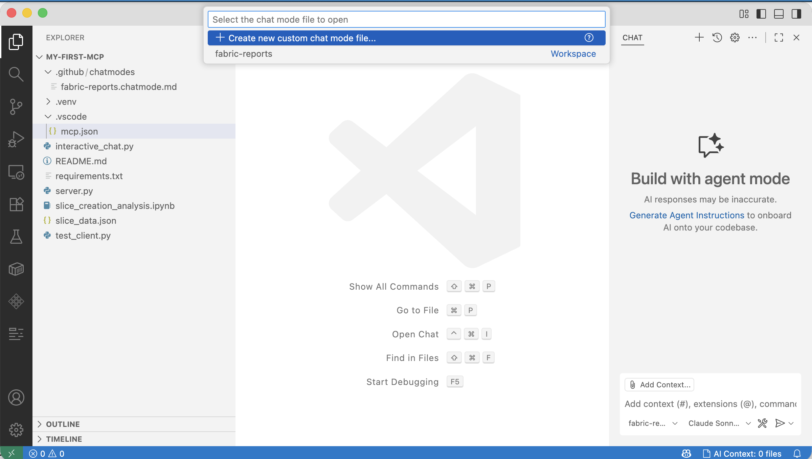
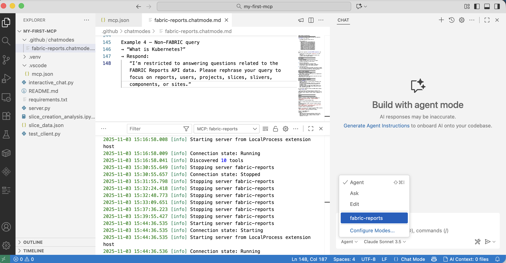

# Set up and use an HTTP-streamable MCP server in VS Code (with a custom Chat mode)

## Table of Contents
- [Set up and use an HTTP-streamable MCP server in VS Code (with a custom Chat mode)](#set-up-and-use-an-http-streamable-mcp-server-in-vs-code-with-a-custom-chat-mode)
  - [Prerequisites](#prerequisites)
  - [1) Create `.vscode/mcp.json` and add your server](#1-create-vscodemcpjson-and-add-your-server)
  - [2) Start the MCP server from VS Code](#2-start-the-mcp-server-from-vs-code)
  - [3) Create a custom Chat mode and add your System prompt](#3-create-a-custom-chat-mode-and-add-your-system-prompt)
  - [4) Use your custom mode with the running MCP server](#4-use-your-custom-mode-with-the-running-mcp-server)
  - [Example “first query” ideas](#example-first-query-ideas)

## Prerequisites

* VS Code (latest)
* The MCP-capable chat extension enabled (e.g., GitHub Copilot Chat with MCP support)
* Your MCP server reachable over HTTPS
* Your per-user token (FABRIC token) handy. You can generate a new FABRIC token by visiting [https://cm.fabric-testbed.net/](https://cm.fabric-testbed.net/).

---

## 1) Create `.vscode/mcp.json` and add your server

In your workspace, create the file `.vscode/mcp.json` (or replace it with the provided `mcp.json`).
The token is prompted once per VS Code session, per user. 

---

## 2) Start the MCP server from VS Code

* Open `.vscode/mcp.json` in the editor.
* Click the **Start** (▶︎) button that appears for the `fabric-reports` server.
* Confirm it shows as **running** (you’ll typically see status in the MCP panel or the editor UI).

---

## 3) Create a custom Chat mode and add your System prompt

* Open the Chat view in VS Code.
* Go to **Configure Modes** → **Create new custom mode chat file**.
* In the new mode file (it’s JSON), give it a name and paste the contents of `fabric-reports.chatmode.md`

Save the file.

---

## 4) Use your custom mode with the running MCP server

* In the Chat window, select the new mode (e.g., **fabric-reports**) from the mode dropdown.
* Ensure your `fabric-reports` MCP server shows up as connected (you’ll see available tools in the Chat sidebar/panel when the server is active).
* Start asking questions—your requests will flow through the custom mode + MCP tools.

---

## Example “first query” ideas

* “List all active slivers connected to AWS, GCP, CloudLab”
* “Show slice utilization by site, excluding FABRIC-owned projects.”
* “Summarize sliver states with counts per state.”

---